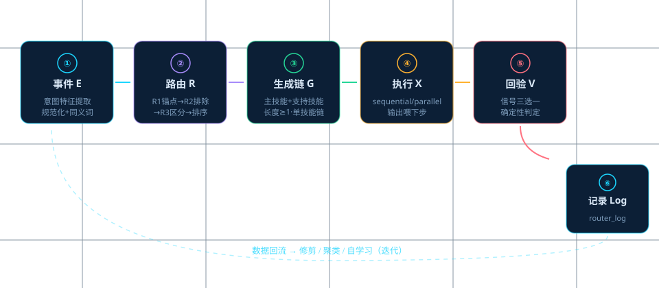
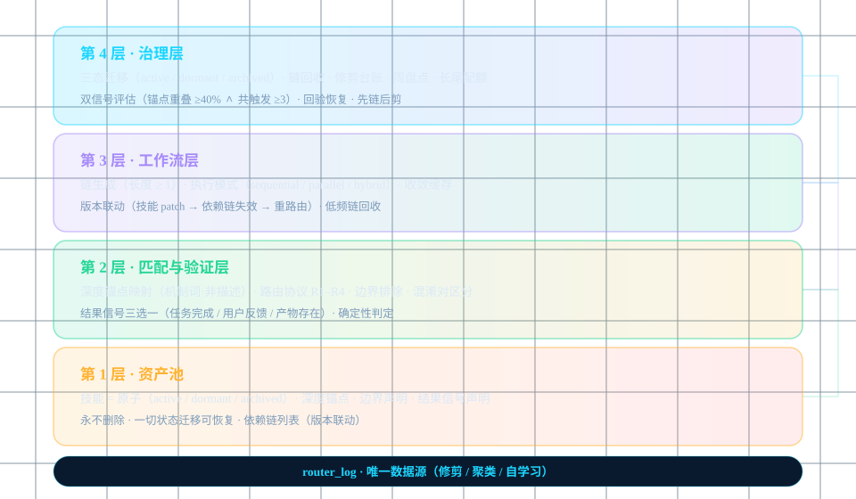
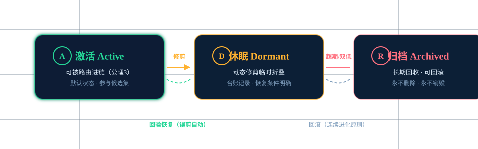
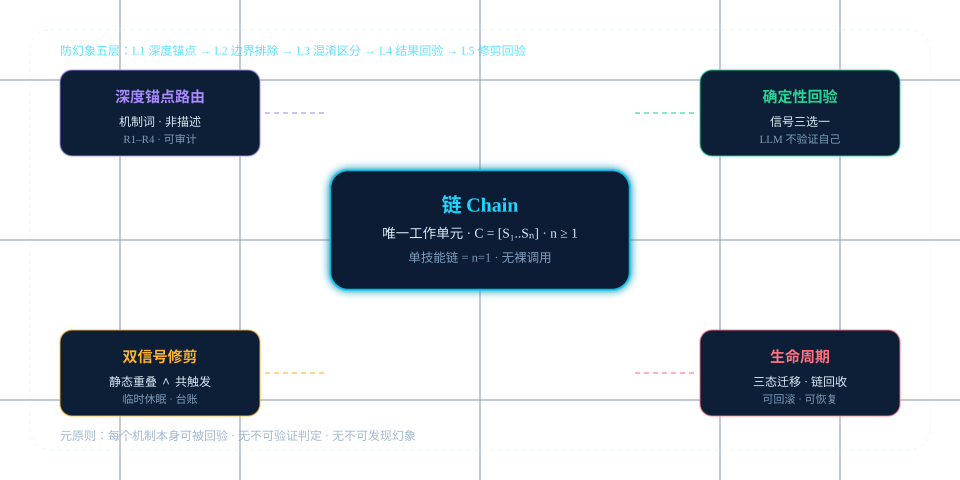

<p align="center">
  
</p>
<p align="center">
  <em style="font-size:2.2em;font-weight:700;letter-spacing:1px;background:linear-gradient(90deg,#1cd6ff,#a78bfa);-webkit-background-clip:text;-webkit-text-fill-color:transparent;">⚡ Skill-Chain Paradigm</em>
</p>
<p align="center">
  <em>技能即原子 · 链是唯一的工作单元 · 修剪即治理 · 验证即裁判</em><br>
  <em>Skills as atoms. Chains as the only unit of work. Pruning as governance. Verification as judge.</em>
</p>

<p align="center">
<a href="https://github.com/Dr-Z0531/skill-chain-paradigm/blob/main/LICENSE">
    
</a>
<a href="https://pypi.org/project/skill-chain-paradigm/">
    
</a>
<a href="https://github.com/Dr-Z0531/skill-chain-paradigm">
    
</a>
</p>

---

**📖 文档**: [入门指南](docs/getting-started/README.md) · [架构总览](docs/architecture/README.md) · [路由协议](docs/architecture/routing.md) · [动态修剪](docs/architecture/pruning.md) · [链生命周期](docs/architecture/chain-lifecycle.md) · [验证](docs/architecture/verification.md)

**🌐 语言**: [English](README-EN.md) · 简体中文

**🧩 示例**: [委派链](examples/delegation_chain.py) · [单技能链](examples/single_skill_chain.py) · [技能索引示例](examples/skills.example.json)

---

## 目录

- [它解决什么问题](#它解决什么问题)
- [核心概念](#核心概念)
- [框架如何运作](#框架如何运作)
- [架构](#架构)
- [设计决策](#设计决策)
- [安装](#安装)
- [快速开始](#快速开始)
- [一个事件的完整旅程](#一个事件的完整旅程)
- [渐进升级](#渐进升级)
- [为什么用它 / 什么时候不该用](#为什么用它--什么时候不该用)
- [文档](#文档)
- [测试](#测试)
- [生态](#生态)
- [贡献](#贡献)
- [许可](#许可)

---

## 它解决什么问题

技能库会无边界地增长。经过数月蒸馏，**250+ 个技能是常态**（作者实测数百个）——而人不可能记住它们。未被调用的技能与不存在等价。结果三件事：

| 问题 | 表现 | 后果 |
|:---|:---|:---|
| **路由幻觉** | 表面词匹配选错技能 | 该用 A 技能时用了 B，产出质量下降 |
| **僵尸技能** | 长期零调用但占着名分 | 库膨胀，每次对话的上下文被稀释 |
| **上下文膨胀** | 每次注入全部技能名 | 注意力稀释——"装得下但找不到" |

传统做法（直接调用技能）还有一个隐藏缺陷：**单技能场景与多技能场景走两套逻辑**——单技能直接调用（无回验、无记录、无修剪数据），多技能走工作流。两套协议的分裂让"效果评估"永远只覆盖一半的工作。

**Skill-Chain Paradigm 回答一个问题：** *当技能从 50 增长到 500+ 时，Agent 生态如何保持"越用越准、越用越轻、越用越稳"？*

答案是一个闭环，不是一堆规则：

```
事件 → 路由（深度锚点·非描述）→ 生成链（长度 ≥ 1）
     → 执行 → 验证（确定性信号）→ 记录 → 修剪 → 迭代
```

## 核心概念

### 技能（Skill）——原子，从不被直接调用

技能是能力单元，携带六项元数据：`deep_anchors`（深度锚点）、`boundary_exclusions`（边界排除）、`confusable_with`（混淆对）、`result_signal`（结果信号）、`state`（三态）、`version`（版本）。它有三个状态：

| 状态 | 定义 | 转换条件 |
|:---|:---|:---|
| **激活** | 默认可被路由 | 进入时默认；从休眠恢复 |
| **休眠** | 动态修剪的临时折叠态 | 冲突/重叠证据达标；原场景回验通过恢复 |
| **归档** | 长期回收态 | 休眠超期或使用率+效果率双低；可回滚 |

**技能从不被删除**——只做状态迁移。删除不可逆，休眠可恢复。

### 链（Chain）——唯一工作单元

链是一个有序技能序列 `C = [S₁, S₂, ..., Sₙ]`，`n ≥ 1`。**任何事件都必须通过链执行，不存在裸技能调用**——单技能事件也走 `n=1` 的单技能链（同样回验、同样记录、同样进入效果评估体系）。

### 调用协议（E→R→G→X→V→Log）

任何事件、任何技能数量、任何链长度，都走同一条路径——**没有特例**：

```
① 事件E → ② 路由R（R1锚点→R2排除→R3区分→排序）→ ③ 生成链G（主+支持技能·n≥1·chain_id）
→ ④ 执行X（seq/par/hyb·前步输出喂下步）→ ⑤ 回验V（结果信号三选一·确定性判定）→ ⑥ 记录Log（router_log·唯一数据源）
```

## 框架如何运作

<p align="center">
  
  <br><em style="font-size:12px;opacity:.6">事件闭环（E→R→G→X→V→Log）</em>
</p>

| 机制 | 输入 | 机制 | 输出 |
|:---|:---|:---|:---|
| **深度锚点路由** | 事件意图文本 | R1 锚点词匹配（核心判断层机制词）→ R2 边界排除先行 → R3 混淆对区分（区分词对二选一）→ 置信度分级（≥2锚点高置信/1锚点中置信/0锚点同义词桥） | 候选技能排序 |
| **链生成** | 候选排序 | 主技能=首候选 → 支持技能追加 → 长度=事件复杂度×可用集×历史效果 | chain 实例（chain_id+长度+执行模式） |
| **确定性回验** | chain 实例 | 结果信号三选一：task_completion（产物+状态）/ user_feedback（显式确认）/ artifact_exists（文件+校验） | pass/fail + 证据 |
| **双信号修剪** | router_log 聚合 | 结构深度（锚点交集≥40%）+ 过程动作（共触发≥3）·两阶段（静态先·动态2周数据后）·修剪回验 L5 | 激活→休眠（可恢复）·台账 |
| **链库收敛** | 同事件链 | 连续 3 次稳定 → 入链库缓存（重放不重路由）·技能 patch → 依赖链失效重路由 | 收敛链 + 版本联动 |

## 架构

<p align="center">
  
</p>

四层结构，资产与匹配分离、匹配与工作流分离、工作流与治理分离：

```
┌─────────────────────────────────────────────────┐
│ 第4层：治理层（修剪 · 生命周期）                   │
│   三态迁移 · 链回收 · 台账 · 周盘点 · 长尾配额     │
├─────────────────────────────────────────────────┤
│ 第3层：工作流层（链 · 唯一工作单元）               │
│   链生成 · 执行模式 · 收敛缓存 · 版本联动          │
├─────────────────────────────────────────────────┤
│ 第2层：匹配与验证层（路由 · 回验）                 │
│   深度锚点映射 · R1-R4 · 结果信号三选一            │
├─────────────────────────────────────────────────┤
│ 第1层：资产池（技能 · 原子）                       │
│   六列映射 · 三态 · 从不删除 · 依赖链列表          │
└─────────────────────────────────────────────────┘
     router_log · 唯一数据源 · 日志先行决策后置
```

**防幻象五层**（生态的第一威胁是路由幻觉·每个机制都可被回验）：

```
L1 深度锚点优先 → L2 边界排除先行 → L3 混淆对区分 → L4 结果信号回验 → L5 修剪回验
元原则: 每个机制可被回验·无不可验证判定·无不可发现幻象
```

## 设计决策

<p align="center">
  
</p>

每个"看起来理所当然"的设计，都有备选方案和拒绝理由：

| 设计 | 备选方案 | 为什么拒绝备选 |
|:---|:---|:---|
| 链是唯一工作单元 | 技能直接调用（简单直接） | 两套逻辑分裂：单技能无回验/记录/修剪数据·效果评估只覆盖一半工作 |
| 深度锚点路由 | description 匹配（零成本） | 表面词幻象：描述是广告·锚点是机制词·广告会夸大·机制词不骗人 |
| 双信号修剪 | 单信号（成本低一半） | 锚点像≠真冲突·共触发多≠真重叠·单信号误剪不可接受（误剪=好技能被藏） |
| 确定性验证 | LLM 自评（零额外层） | 判定者=执行者="通过"只证明模型认为自己对·logical-verification agent paper 实证：加独立逻辑层 78→98% |
| 临时休眠 | 永久删除（库更干净） | 删除不可逆·技能价值可能在未来场景出现·休眠可恢复·删除不能 |
| 首版阈值保守 | 直接定终值（一步到位） | 拒绝魔法数：阈值必须按真实分布校准·首版保守·2周后按 router_log 分布定标 |

## 安装

**Python 3.10+**（纯 stdlib·零外部依赖）：

```bash
# 从源码使用（克隆后直接可用·无需安装）
git clone https://github.com/Dr-Z0531/skill-chain-paradigm.git
cd skill-chain-paradigm

# 或安装为包
pip install -e .
```

## 快速开始

```bash
# 组件自测（R1·四组件）
python -m src.router.generator --selftest
python -m src.verifier.verifier --selftest
python -m src.pruner.pruner --selftest
python -m src.store.chain_store --selftest

# 路由一个事件（长尾路由需设置 SKILL_CHAIN_SKILLS_ROOT 指向你的技能目录）
python -m src.router.generator "三个代理协作开发怎么分工"

# 回验产物
python -m src.verifier.verifier artifact_exists <path> <chain_id>

# 测试案例回归
python -m pytest tests/ -v
```

## 一个事件的完整旅程

**场景**：用户说"委派给子代理的产出怎么验证可靠？怕假阳性"。

| 步骤 | 发生什么 | 中间产物 |
|:---|:---|:---|
| ① 特征提取 | 规范化: `{验证, 假阳性, 可靠, 产物}` | 特征集 |
| ② 路由 | R1: "假阳性/验证"命中 verification；R2: 无排除词；R3: eval-framework 候选但区分词对裁决（"验证架构"→verification） | [verification(2), eval(1)] |
| ③ 链生成 | 主技能=verification·长度=1 | chain-xxxxx-1 |
| ④ 链执行 | verification 方法论（防自述可信/逻辑层判定/双保险） | 验证报告 |
| ⑤ 回验 | artifact_exists: 报告文件存在+JSON 有效 | pass |
| ⑥ 记录 | router_log 条目（含路由质量标记） | 日志 → 修剪/聚类数据 |

**如果只有一个技能匹配**（如"验证"但无"评估"需求）：生成 `length=1` 的单技能链——同样走①-⑥，同样被记录——这就是"无裸调用"的日常形态。

## 渐进升级

### 基础：单技能链（n=1）

```bash
python examples/single_skill_chain.py
```

### 升级一：多技能链（n=2·顺序）

在技能索引中加入 eval，事件"验证+评估"自动生成 `[verification → eval]`——**协议不变**，只有长度变。

### 升级二：委派链（n=4·顺序）

加入 strategic/orchestration，"多代理协作+分工+验证"生成 `[strategic → orchestration → verification → eval]`——四技能顺序协作，每步输出喂下步。

### 升级三：启用修剪治理

运行 2 周后，router_log 积累数据 → `pruner.py` 双信号评估 → 冲突技能休眠 → 台账+周盘点+回验恢复。

**渐进路径的共同点**：从 n=1 到 n=4，从执行到治理——**协议从未改变**。这就是"链"作为唯一工作单元的扩展性证明。

## 为什么用它 / 什么时候不该用

**为什么用它：**
- 技能库超过 50 个且还在增长——人工维护路由开始失效
- 多技能协作场景频繁（委派/蒸馏/验证/进化）——需要标准化的链式工作流
- 需要"可回验"的生态——每个机制都能被结果信号检验
- 需要可回滚的治理——修剪/归档/失效全部可逆
- 需要单技能与多技能场景统一评估——拒绝"一半工作没有效果数据"

**什么时候不该用：**
- 技能库很小（<20）且稳定——直接维护清单即可
- 单次脚本任务——链协议是过度设计
- 无法定义"结果信号"的场景——没有信号就没有验证，没有验证就没有闭环
- 纯人工验收已经足够——框架解决的是"系统级可靠性"，不是"人工流程"问题

## 文档

| 文档 | 内容 |
|:---|:---|
| [入门指南](docs/getting-started/README.md) | 从零到运行的完整教程（含事件旅程图） |
| [架构总览](docs/architecture/README.md) | 四层结构 + 闭环模型 + 设计决策 |
| [路由协议 R1–R4](docs/architecture/routing.md) | 每步的判定机制与"为什么" |
| [动态修剪](docs/architecture/pruning.md) | 双信号评估 + 可逆迁移 + 回验恢复 |
| [链生命周期](docs/architecture/chain-lifecycle.md) | 收敛缓存 + 版本联动 + 回收 |
| [验证协议](docs/architecture/verification.md) | 结果信号三选一 + 确定性判定 |

## 测试

```bash
python -m pytest tests/ -v
```

覆盖：路由（13 案例·正例/负例/长尾/混淆区分）· 修剪（结构重叠·混淆对排除）· 验证（三信号 PASS/FAIL 分支）· 链库（3 次收敛·patch 失效·回收）。

## 生态

<p align="center">
  
  <br><em style="font-size:12px;opacity:.6">技能生态（路由·回验·修剪·链化）</em>
</p>

- **router_log**：唯一数据源（JSONL·append-only）——路由证据 + 回验结果 → 修剪/聚类/自学习
- **weekly_review**：周盘点（使用率 + 效果率双指标·双低观察·恢复条件）
- **长尾自动升锚**：高使用率长尾技能升级深度锚定（分层路由: 核心11深度锚定 + 长尾目录兜底）
- **测试隔离**：临时路径 + 运行后清理（防污染真实数据）

## 贡献

请阅读 [CONTRIBUTING.md](CONTRIBUTING.md) 与 [CODE_OF_CONDUCT.md](CODE_OF_CONDUCT.md)。所有变更请遵循 [CHANGELOG.md](CHANGELOG.md) 记录。

## 许可

[MIT License](LICENSE) · Copyright (c) 2026 the maintainers

## 0.3.0 新增（2026-08-08）

- **混淆词对库**: src/data/confusion_pairs.json（10对·机器可读·R3混淆裁决强化）
- **稳定性协议**: docs/architecture/stability.md（修剪回滚快照/阈值校准/SoT注入）
- **测试**: 22/22 passed（含4项词对校验）

### 0.3.0 终态（2026-08-08 深夜·全量审查修正后）

- **混淆词对库**: src/data/confusion_pairs.json（**13对**·本地state全量同步·机器可读·R3混淆裁决强化）
- **稳定性协议**: docs/architecture/stability.md（修剪回滚快照/阈值校准/SoT注入）
- **代码同步**: 本地运行版基线（misroute≥2词/验证必加/deep-review/SKILL_CHAIN_SKILLS_ROOT）
- **验证**: 22/22测试 · 泄露零命中 · 校验SHA256SUMS · 全量文档-实现一致性核验通过

### 📐 算法设计（Algorithm Design）

每份架构文档含**可执行算法规格**（伪代码+参数表+边界条件）:
- [路由算法 R1-R4](docs/architecture/routing.md)（锚点/排除/混淆裁决/置信分级）
- [修剪算法（两阶段）](docs/architecture/pruning.md)（静态40%重叠+动态共触发≥3+回验恢复）
- [链生命周期算法](docs/architecture/chain-lifecycle.md)（指纹收敛3次/patch失效/归档回收）
- [回验算法（三信号）](docs/architecture/verification.md)（task_completion/user_feedback/artifact_exists）
- [稳定性参数表](docs/architecture/stability.md)（θ_t/θ_e/K_max/θ_c/θ_i/α/β/η·全可校准）
